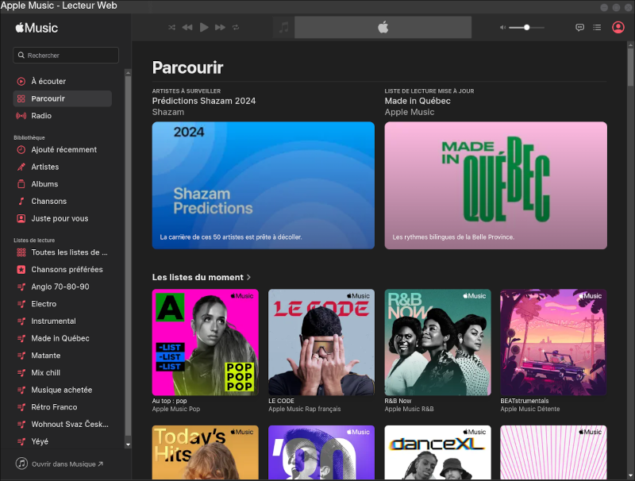

# apple-music-desktop-client
Unofficial desktop client for Apple Music for Linux

## Note
This application is not verified by, affiliated with, or supported by Apple.

# Install
For Now, only AppImage, Flatpak file and tar.gz are provided. You can download it here: https://github.com/Tabinol/apple-music-desktop-client/releases

## AppImage
I recommend to use App Image Launcher: https://github.com/TheAssassin/AppImageLauncher

## Flatpak
This project is not (yet) in the Flathub repository. Only a _.flatpak_ file is available.
    
    flatpak install /path/to/file.flatpak

# Inspiration
Apple Music project for Snap: https://github.com/cross-platform/apple-music-for-linux
